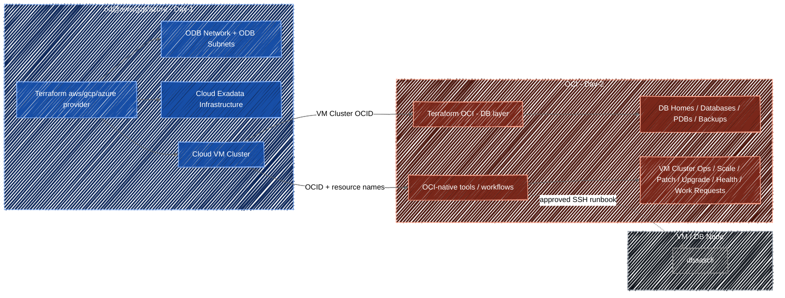

# Day-1 and Day-2 Control Plane Model for Oracle Database@Google Cloud

This control plane model applies when Oracle Database@Google Cloud Exadata Infrastructure and VM Clusters are deployed from Google Cloud and operated from OCI. It works for a single deployment and for multiple deployments operated at scale.

## Recommendation

Use **Google Terraform for Day-1 provisioning** and **OCI-native tooling for Day-2 operations**.

The ownership rule is simple:

* The Terraform module in this repository creates or references the Google-side deployment resources and remains the Day-1 owner.
* OCI tooling operates the VM Cluster and database layer after creation.
* Do not keep the same VM Cluster under two independent Terraform owners.
* Treat OCI Terraform for VM Cluster changes as a supported escape hatch, not the recommended operating pattern.
* Keep the first implementation simple; split states only when ownership, permissions, lifecycle, or blast radius require it.

## Recommended Terraform Modules

Use this repository's module as the standard Google Terraform interface for Day-1 provisioning. It captures the ODB Network, ODB Subnet, Cloud Exadata Infrastructure, and Cloud VM Cluster resource graph, along with module-key references, defaults, outputs, operation timeouts, and the dual control-plane drift policy described by this control plane model.

For OCI-side declarative database-layer automation, use the OCI Landing Zones Exadata Database module when it fits the customer lifecycle. In this model, it is a good fit for DB Homes, container databases, and pluggable databases that consume the VM Cluster OCID produced by the Google stack.

Do not make the OCI module the default Terraform owner for the Google-created VM Cluster. Use its VM Cluster capability only through the controlled exception path in this document, after import, clean OCI and Google plans, and explicit approval.

## Operating at Scale

Apply the same ownership rule per deployment unit, whether that unit is one VM Cluster, one application estate, one environment, or one region. Scale comes from repeating a clear pattern, not from changing the control-plane model.

For multiple deployments:

* Keep Google-side Day-1 resources in Google Terraform states aligned to real ownership boundaries such as environment, region, workload, or platform team.
* Keep OCI-side database-layer automation in separate OCI Terraform states when the database lifecycle, operators, permissions, or change windows differ from the Google-side deployment.
* Publish only the outputs needed across the boundary, especially VM Cluster OCIDs, resource names, regions, and project or compartment identifiers.
* Avoid a global megastack unless the resources genuinely share lifecycle and operators. Also avoid splitting state only for aesthetics; split when it reduces blast radius or clarifies ownership.
* Standardize plan review, drift review, change evidence, break-glass handling, and Day-2 runbooks across all deployments.

## Control Plane Diagram

> **Note:** OCI-native tools and workflows include OCI Console, OCI CLI, SDKs, Ansible, Exadata Fleet Update (EFU), and approved pipelines. The selected tool should match the operation and Oracle support guidance.
>
> The diagram shows the recommended operating pattern only. The OCI Terraform VM Cluster import path is intentionally excluded because it is an exception, not the default control-plane model.

## Tooling Model

| Area | Recommended tool |
| --- | --- |
| ODB Network and ODB Subnets | Google Terraform |
| Cloud Exadata Infrastructure | Google Terraform |
| Cloud VM Cluster creation | Google Terraform |
| Google-side bootstrap, discovery, and evidence | Google Cloud CLI (`gcloud`) or Google Cloud Console |
| DB Homes, databases, PDBs, and backups | OCI Terraform with the OCI Landing Zones Exadata Database module when declarative lifecycle is required; otherwise OCI-native database tooling |
| CPU/ECPU scaling | OCI CLI, SDK, Ansible, OCI Console, or approved OCI-native pipeline |
| Patching and upgrades | OCI-native patching workflow: Exadata Fleet Update, OCI Console, OCI CLI, SDK, Ansible, or `dbaascli` when directed by Oracle documentation/support |
| Node-local DBA tasks | `dbaascli` through approved SSH runbooks |
| Health checks and evidence | OCI CLI, SDK, Ansible, logs, work requests |

`dbaascli` is not a control plane. It runs inside the VM/DB node and must not be treated as a Terraform owner.

## Day-1 Provisioning

Day-1 is the Google-side deployment. Use this repository's module as the standard implementation unless a customer has a specific reason to manage the Google provider resources directly.

Use it to create or reference:

* ODB Network.
* Client ODB Subnet.
* Backup ODB Subnet.
* Cloud Exadata Infrastructure.
* Cloud VM Cluster.

## Google Cloud CLI Usage

`gcloud` is a supported Google-side interface for Oracle Database@Google Cloud, but it is not the recommended owner for resources managed by Google Terraform.

Use `gcloud` for:

* Google-side bootstrap checks, API enablement, authentication, and IAM validation.
* Read-only discovery such as list and describe operations.
* Evidence capture for change records and audits.
* Break-glass actions when approved by the change process.

Do not use `gcloud` as a parallel Day-1 owner for ODB Networks, ODB Subnets, Cloud Exadata Infrastructure, or Cloud VM Clusters that are managed by Google Terraform. If a break-glass `gcloud` action changes a Terraform-managed resource, reconcile state and run a Google Terraform plan before closing the change.

## Day-2 Operations

Day-2 is OCI-side operation after the VM Cluster exists.

The default Day-2 model is:

* Use OCI Terraform for database-layer resources when declarative lifecycle is required; prefer the OCI Landing Zones Exadata Database module when its contract matches the required DB Home, database, PDB, and backup lifecycle.
* Use OCI CLI, SDK, Ansible, or OCI Console for VM Cluster operational changes by default.
* Do not use OCI Terraform as the default tool for VM Cluster operational changes; reserve it for the controlled exception path.
* Use the OCI-native patching workflow that matches the target and operation. Exadata Fleet Update is one option for supported fleet campaigns.
* Use `dbaascli` only for approved node-local DBA operations.
* Run a Google Terraform plan after OCI-side changes to confirm no unexpected drift is proposed.

## Capacity Scaling

Do not scale CPU/ECPU by changing the Google Terraform VM Cluster input after Day-1. The Google stack records the initial VM Cluster creation intent; operational capacity changes should be performed from OCI.

Recommended runbook:

1. Get the VM Cluster OCID from the Google Terraform output.
2. Read the current VM Cluster state from OCI.
3. Validate target CPU/ECPU count, service limits, and maintenance constraints.
4. Scale from OCI using OCI CLI, SDK, Ansible, OCI Console, or an approved OCI-native pipeline.
5. Wait for the VM Cluster to return to an available state.
6. Run database and listener checks.
7. Record the OCI work request ID and final capacity.
8. Run a Google Terraform plan and review the result.

The Google Terraform module ignores operational capacity drift for the VM Cluster so OCI-side scaling is not reverted by the Google stack.

If the customer requires declarative OCI Terraform for VM Cluster capacity changes, use the exception path below instead of the recommended runbook.

## OCI Terraform VM Cluster Escape Hatch

OCI Terraform can be used for supported VM Cluster updates, including declarative capacity changes. Treat it as a supported escape hatch, not as the recommended operating pattern.

Use this path only when all of these are true:

* The customer has approved an exception that requires declarative OCI-side lifecycle for the VM Cluster operation.
* The VM Cluster OCID produced by Google Terraform is available.
* The OCI Terraform resource is imported and produces a clean plan before any update.
* The Google Terraform stack has lifecycle drift controls for fields changed from OCI.
* Both Google and OCI Terraform plans are reviewed during the change.

Minimum exception runbook:

1. Export the VM Cluster OCID from the Google Terraform output.
2. Import the VM Cluster into OCI Terraform as `oci_database_cloud_vm_cluster`.
3. Generate or write OCI Terraform configuration from the imported resource.
4. Run an OCI Terraform plan and resolve all unintended differences.
5. Apply only the intended VM Cluster update.
6. Capture the OCI work request ID and final VM Cluster state.
7. Run a Google Terraform plan and confirm it does not try to reverse the OCI-side change.

When using a reusable OCI module for this exception, keep the module scope constrained to the imported VM Cluster operation and review every generated argument. Do not combine the exception with unrelated DB-layer changes in the same apply.

## Patching and Upgrades

Use the OCI-native patching workflow that matches the target, scope, and support guidance. Exadata Fleet Update is one option for supported fleet campaigns; it is not the only patching or upgrade path.

The runbook should cover:

1. Targets and scope.
2. Pre-checks.
3. Maintenance window.
4. Patching or upgrade execution with the selected OCI-native workflow.
5. Work request monitoring.
6. Post-checks.
7. Evidence capture.

OCI Console, OCI CLI, SDK, Ansible, Exadata Fleet Update, `dbaascli`, or a pipeline can be part of the runbook depending on the supported operation. Keep the selected path explicit in the change record.

## Node-Local DBA Operations

Use `dbaascli` only when the task must run inside the VM/DB node.

Good fit:

* Local database, DB Home, and PDB operations supported by Oracle documentation.
* Local diagnostics.
* Approved local remediation steps.

Not a good fit:

* Creating Google-side resources.
* Creating or owning the VM Cluster.
* CPU/ECPU scaling.
* Replacing the selected OCI-native patching workflow for fleet patching and upgrades.
* Long-lived infrastructure ownership.

## Terraform State Rule

Use one owner per resource. Google Terraform is the default Day-1 owner for the VM Cluster. OCI Terraform ownership of VM Cluster updates is supported only as a controlled exception. That exception requires import, generated or reviewed configuration, clean OCI and Google plans, and explicit drift controls in the Google stack.

## Minimum Guardrails

* Keep Terraform state in a remote backend with restricted access and versioning.
* Separate state only when lifecycle, ownership, permissions, or blast radius require it.
* Treat cross-stack outputs as contracts and keep them limited to the identifiers downstream stacks actually need.
* Keep OCI-side Terraform focused on database-layer resources unless the VM Cluster exception path has been approved.
* Keep Google Terraform responsible for Day-1 resources and OCI tooling responsible for Day-2 operations.
* Use `gcloud` for Google-side bootstrap, read-only discovery, evidence, or approved break-glass actions; do not use it as a parallel owner for Terraform-managed resources.
* Capture change ticket, operator, OCI work request ID, command output, and post-check result for every operation.
* Do not store real `terraform.tfvars` or state files in Git.

## Official References

- Oracle Database@Google Cloud overview (https://docs.cloud.google.com/oracle/database/docs/overview)
- Google Cloud CLI gcloud oracle-database (https://docs.cloud.google.com/sdk/gcloud/reference/oracle-database)
- Manage Exadata VM Clusters (https://docs.cloud.google.com/oracle/database/docs/manage-clusters)
- Create Exadata VM Clusters (https://docs.cloud.google.com/oracle/database/docs/create-clusters)
- Modify an Exadata VM Cluster with OCI Terraform (https://docs.oracle.com/en-us/iaas/Content/database-at-gcp/gcpmd-modify-exadata-vm-cluster.html)
- OCI Terraform oci_database_cloud_vm_cluster (https://docs.oracle.com/en-us/iaas/tools/terraform-provider-oci/latest/docs/r/database_cloud_vm_cluster.html)
- OCI Landing Zones Exadata Database module (https://github.com/oci-landing-zones/terraform-oci-modules-exadata/tree/main/exadata-database)
- Exadata Fleet Update Administrator's Guide (https://docs.oracle.com/en-us/iaas/exadata-fleet-update/doc/overview.html)
- Using the dbaascli Utility on Exadata Cloud Infrastructure (https://docs.oracle.com/en/engineered-systems/exadata-cloud-service/ecscm/ecs-using-dbaascli.html)
- Terraform state (https://developer.hashicorp.com/terraform/language/state)
- Terraform import (https://developer.hashicorp.com/terraform/cli/import)
- Terraform GCS backend (https://developer.hashicorp.com/terraform/language/backend/gcs)
- OCI Ansible collection (https://docs.public.content.oci.oraclecloud.com/iaas/Content/API/SDKDocs/ansible.htm)
